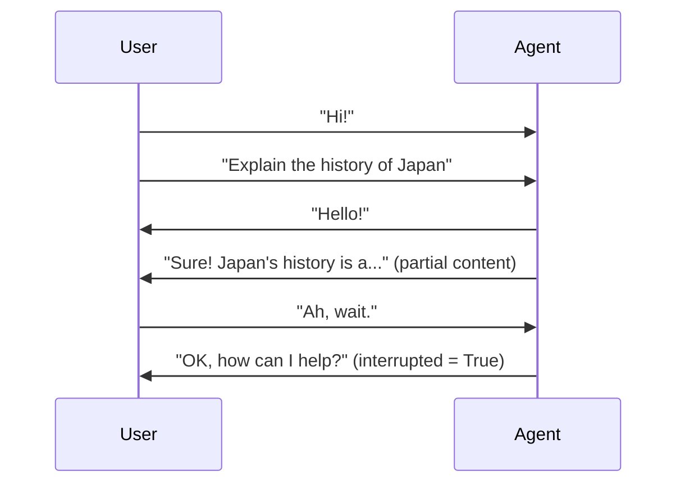
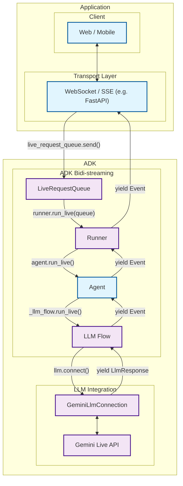

Directory structure:
└── streaming/
    ├── configuration.md
    ├── custom-streaming-ws.md
    ├── custom-streaming.md
    ├── index.md
    ├── streaming-tools.md
    └── dev-guide/
        └── part1.md

================================================
FILE: docs/streaming/configuration.md
================================================
# Configurating streaming behaviour

There are some configurations you can set for live(streaming) agents. 

It's set by [RunConfig](https://github.com/google/adk-python/blob/main/src/google/adk/agents/run_config.py). You should use RunConfig with your [Runner.run_live(...)](https://github.com/google/adk-python/blob/main/src/google/adk/runners.py). 

For example, if you want to set voice config, you can leverage speech_config. 

```python
voice_config = genai_types.VoiceConfig(
    prebuilt_voice_config=genai_types.PrebuiltVoiceConfigDict(
        voice_name='Aoede'
    )
)
speech_config = genai_types.SpeechConfig(voice_config=voice_config)
run_config = RunConfig(speech_config=speech_config)

runner.run_live(
    ...,
    run_config=run_config,
)
```


================================================
FILE: docs/streaming/custom-streaming-ws.md
================================================
# Custom Audio Streaming app (WebSocket) {#custom-streaming-websocket}

This article overviews the server and client code for a custom asynchronous web app built with ADK Streaming and [FastAPI](https://fastapi.tiangolo.com/), enabling real-time, bidirectional audio and text communication with WebSockets.

**Note:** This guide assumes you have experience of JavaScript and Python `asyncio` programming.

## Supported models for voice/video streaming {#supported-models}

In order to use voice/video streaming in ADK, you will need to use Gemini models that support the Live API. You can find the **model ID(s)** that supports the Gemini Live API in the documentation:

- [Google AI Studio: Gemini Live API](https://ai.google.dev/gemini-api/docs/models#live-api)
- [Vertex AI: Gemini Live API](https://cloud.google.com/vertex-ai/generative-ai/docs/live-api)

There is also a [SSE](custom-streaming.md) version of the sample is available.

## 1. Install ADK {#1.-setup-installation}

Create & Activate Virtual Environment (Recommended):

```bash
# Create
python -m venv .venv
# Activate (each new terminal)
# macOS/Linux: source .venv/bin/activate
# Windows CMD: .venv\Scripts\activate.bat
# Windows PowerShell: .venv\Scripts\Activate.ps1
```

Install ADK:

```bash
pip install --upgrade google-adk==1.2.1
```

Set `SSL_CERT_FILE` variable with the following command.

```shell
export SSL_CERT_FILE=$(python -m certifi)
```

Download the sample code:

```bash
git clone --no-checkout https://github.com/google/adk-docs.git
cd adk-docs
git sparse-checkout init --cone
git sparse-checkout set examples/python/snippets/streaming/adk-streaming-ws
git checkout main
cd examples/python/snippets/streaming/adk-streaming-ws/app
```

This sample code has the following files and folders:

```console
adk-streaming-ws/
└── app/ # the web app folder
    ├── .env # Gemini API key / Google Cloud Project ID
    ├── main.py # FastAPI web app
    ├── static/ # Static content folder
    |   ├── js # JavaScript files folder (includes app.js)
    |   └── index.html # The web client page
    └── google_search_agent/ # Agent folder
        ├── __init__.py # Python package
        └── agent.py # Agent definition
```

## 2\. Set up the platform {#2.-set-up-the-platform}

To run the sample app, choose a platform from either Google AI Studio or Google Cloud Vertex AI:

=== "Gemini - Google AI Studio"
    1. Get an API key from [Google AI Studio](https://aistudio.google.com/apikey).
    2. Open the **`.env`** file located inside (`app/`) and copy-paste the following code.

        ```env title=".env"
        GOOGLE_GENAI_USE_VERTEXAI=FALSE
        GOOGLE_API_KEY=PASTE_YOUR_ACTUAL_API_KEY_HERE
        ```

    3. Replace `PASTE_YOUR_ACTUAL_API_KEY_HERE` with your actual `API KEY`.

=== "Gemini - Google Cloud Vertex AI"
    1. You need an existing
       [Google Cloud](https://cloud.google.com/?e=48754805&hl=en) account and a
       project.
        * Set up a
          [Google Cloud project](https://cloud.google.com/vertex-ai/generative-ai/docs/start/quickstarts/quickstart-multimodal#setup-gcp)
        * Set up the
          [gcloud CLI](https://cloud.google.com/vertex-ai/generative-ai/docs/start/quickstarts/quickstart-multimodal#setup-local)
        * Authenticate to Google Cloud, from the terminal by running
          `gcloud auth login`.
        * [Enable the Vertex AI API](https://console.cloud.google.com/flows/enableapi?apiid=aiplatform.googleapis.com).
    2. Open the **`.env`** file located inside (`app/`). Copy-paste
       the following code and update the project ID and location.

        ```env title=".env"
        GOOGLE_GENAI_USE_VERTEXAI=TRUE
        GOOGLE_CLOUD_PROJECT=PASTE_YOUR_ACTUAL_PROJECT_ID
        GOOGLE_CLOUD_LOCATION=us-central1
        ```


### agent.py

The agent definition code `agent.py` in the `google_search_agent` folder is where the agent's logic is written:


```py
from google.adk.agents import Agent
from google.adk.tools import google_search  # Import the tool

root_agent = Agent(
   name="google_search_agent",
   model="gemini-2.0-flash-exp", # if this model does not work, try below
   #model="gemini-2.0-flash-live-001",
   description="Agent to answer questions using Google Search.",
   instruction="Answer the question using the Google Search tool.",
   tools=[google_search],
)
```

**Note:**  To enable both text and audio/video input, the model must support the generateContent (for text) and bidiGenerateContent methods. Verify these capabilities by referring to the [List Models Documentation](https://ai.google.dev/api/models#method:-models.list). This quickstart utilizes the gemini-2.0-flash-exp model for demonstration purposes.

Notice how easily you integrated [grounding with Google Search](https://ai.google.dev/gemini-api/docs/grounding?lang=python#configure-search) capabilities.  The `Agent` class and the `google_search` tool handle the complex interactions with the LLM and grounding with the search API, allowing you to focus on the agent's *purpose* and *behavior*.


## 3\. Interact with Your Streaming app {#3.-interact-with-your-streaming-app}

1\. **Navigate to the Correct Directory:**

   To run your agent effectively, make sure you are in the **app folder (`adk-streaming-ws/app`)**

2\. **Start the Fast API**: Run the following command to start CLI interface with

```console
uvicorn main:app --reload
```

3\. **Access the app with the text mode:** Once the app starts, the terminal will display a local URL (e.g., [http://localhost:8000](http://localhost:8000)). Click this link to open the UI in your browser.

Now you should see the UI like this:


Try asking a question `What time is it now?`. The agent will use Google Search to respond to your queries. You would notice that the UI shows the agent's response as streaming text. You can also send messages to the agent at any time, even while the agent is still responding. This demonstrates the bidirectional communication capability of ADK Streaming.

4\. **Access the app with the audio mode:** Now click the `Start Audio` button. The app reconnects with the server in an audio mode, and the UI will show the following dialog for the first time:


Click `Allow while visiting the site`, then you will see the microphone icon will be shown at the top of the browser:


Now you can talk to the agent with voice. Ask questions like `What time is it now?` with voice and you will hear the agent responding in voice too. As Streaming for ADK supports [multiple languages](https://ai.google.dev/gemini-api/docs/live#supported-languages), it can also respond to question in the supported languages.

5\. **Check console logs**

If you are using the Chrome browser, use the right click and select `Inspect` to open the DevTools. On the `Console`, you can see the incoming and outgoing audio data such as `[CLIENT TO AGENT]` and `[AGENT TO CLIENT]`, representing the audio data streaming in and out between the browser and the server.

At the same time, in the app server console, you should see something like this:

```
INFO:     ('127.0.0.1', 50068) - "WebSocket /ws/70070018?is_audio=true" [accepted]
Client #70070018 connected, audio mode: true
INFO:     connection open
INFO:     127.0.0.1:50061 - "GET /static/js/pcm-player-processor.js HTTP/1.1" 200 OK
INFO:     127.0.0.1:50060 - "GET /static/js/pcm-recorder-processor.js HTTP/1.1" 200 OK
[AGENT TO CLIENT]: audio/pcm: 9600 bytes.
INFO:     127.0.0.1:50082 - "GET /favicon.ico HTTP/1.1" 404 Not Found
[AGENT TO CLIENT]: audio/pcm: 11520 bytes.
[AGENT TO CLIENT]: audio/pcm: 11520 bytes.
```

These console logs are important in case you develop your own streaming application. In many cases, the communication failure between the browser and server becomes a major cause for the streaming application bugs.

6\. **Troubleshooting tips**

- **When `ws://` doesn't work:** If you see any errors on the Chrome DevTools with regard to `ws://` connection, try replacing `ws://` with `wss://` on `app/static/js/app.js` at line 28. This may happen when you are running the sample on a cloud environment and using a proxy connection to connect from your browser.
- **When `gemini-2.0-flash-exp` model doesn't work:** If you see any errors on the app server console with regard to `gemini-2.0-flash-exp` model availability, try replacing it with `gemini-2.0-flash-live-001` on `app/google_search_agent/agent.py` at line 6.

## 4. Server code overview {#4.-server-side-code-overview}

This server app enables real-time, streaming interaction with ADK agent via WebSockets. Clients send text/audio to the ADK agent and receive streamed text/audio responses.

Core functions:
1.  Initialize/manage ADK agent sessions.
2.  Handle client WebSocket connections.
3.  Relay client messages to the ADK agent.
4.  Stream ADK agent responses (text/audio) to clients.

### ADK Streaming Setup

```py
import os
import json
import asyncio
import base64

from pathlib import Path
from dotenv import load_dotenv

from google.genai.types import (
    Part,
    Content,
    Blob,
)

from google.adk.runners import Runner
from google.adk.agents import LiveRequestQueue
from google.adk.agents.run_config import RunConfig
from google.adk.sessions.in_memory_session_service import InMemorySessionService

from fastapi import FastAPI, WebSocket
from fastapi.staticfiles import StaticFiles
from fastapi.responses import FileResponse

from google_search_agent.agent import root_agent
```

*   **Imports:** Includes standard Python libraries, `dotenv` for environment variables, Google ADK, and FastAPI.
*   **`load_dotenv()`:** Loads environment variables.
*   **`APP_NAME`**: Application identifier for ADK.
*   **`session_service = InMemorySessionService()`**: Initializes an in-memory ADK session service, suitable for single-instance or development use. Production might use a persistent store.

### `start_agent_session(session_id, is_audio=False)`

```py
async def start_agent_session(user_id, is_audio=False):
    """Starts an agent session"""

    # Create a Runner
    runner = InMemoryRunner(
        app_name=APP_NAME,
        agent=root_agent,
    )

    # Create a Session
    session = await runner.session_service.create_session(
        app_name=APP_NAME,
        user_id=user_id,  # Replace with actual user ID
    )

    # Set response modality
    modality = "AUDIO" if is_audio else "TEXT"
    run_config = RunConfig(response_modalities=[modality])

    # Create a LiveRequestQueue for this session
    live_request_queue = LiveRequestQueue()

    # Start agent session
    live_events = runner.run_live(
        session=session,
        live_request_queue=live_request_queue,
        run_config=run_config,
    )
    return live_events, live_request_queue
```

This function initializes an ADK agent live session.

| Parameter    | Type    | Description                                             |
|--------------|---------|---------------------------------------------------------|
| `user_id` | `str`   | Unique client identifier.                       |
| `is_audio`   | `bool`  | `True` for audio responses, `False` for text (default). |

**Key Steps:**
1\.  **Create Runner:** Instantiates the ADK runner for the `root_agent`.
2\.  **Create Session:** Establishes an ADK session.
3\.  **Set Response Modality:** Configures agent response as "AUDIO" or "TEXT".
4\.  **Create LiveRequestQueue:** Creates a queue for client inputs to the agent.
5\.  **Start Agent Session:** `runner.run_live(...)` starts the agent, returning:
    *   `live_events`: Asynchronous iterable for agent events (text, audio, completion).
    *   `live_request_queue`: Queue to send data to the agent.

**Returns:** `(live_events, live_request_queue)`.

### `agent_to_client_messaging(websocket, live_events)`

```py

async def agent_to_client_messaging(websocket, live_events):
    """Agent to client communication"""
    while True:
        async for event in live_events:

            # If the turn complete or interrupted, send it
            if event.turn_complete or event.interrupted:
                message = {
                    "turn_complete": event.turn_complete,
                    "interrupted": event.interrupted,
                }
                await websocket.send_text(json.dumps(message))
                print(f"[AGENT TO CLIENT]: {message}")
                continue

            # Read the Content and its first Part
            part: Part = (
                event.content and event.content.parts and event.content.parts[0]
            )
            if not part:
                continue

            # If it's audio, send Base64 encoded audio data
            is_audio = part.inline_data and part.inline_data.mime_type.startswith("audio/pcm")
            if is_audio:
                audio_data = part.inline_data and part.inline_data.data
                if audio_data:
                    message = {
                        "mime_type": "audio/pcm",
                        "data": base64.b64encode(audio_data).decode("ascii")
                    }
                    await websocket.send_text(json.dumps(message))
                    print(f"[AGENT TO CLIENT]: audio/pcm: {len(audio_data)} bytes.")
                    continue

            # If it's text and a parial text, send it
            if part.text and event.partial:
                message = {
                    "mime_type": "text/plain",
                    "data": part.text
                }
                await websocket.send_text(json.dumps(message))
                print(f"[AGENT TO CLIENT]: text/plain: {message}")
```

This asynchronous function streams ADK agent events to the WebSocket client.

**Logic:**
1.  Iterates through `live_events` from the agent.
2.  **Turn Completion/Interruption:** Sends status flags to the client.
3.  **Content Processing:**
    *   Extracts the first `Part` from event content.
    *   **Audio Data:** If audio (PCM), Base64 encodes and sends it as JSON: `{ "mime_type": "audio/pcm", "data": "<base64_audio>" }`.
    *   **Text Data:** If partial text, sends it as JSON: `{ "mime_type": "text/plain", "data": "<partial_text>" }`.
4.  Logs messages.

### `client_to_agent_messaging(websocket, live_request_queue)`

```py

async def client_to_agent_messaging(websocket, live_request_queue):
    """Client to agent communication"""
    while True:
        # Decode JSON message
        message_json = await websocket.receive_text()
        message = json.loads(message_json)
        mime_type = message["mime_type"]
        data = message["data"]

        # Send the message to the agent
        if mime_type == "text/plain":
            # Send a text message
            content = Content(role="user", parts=[Part.from_text(text=data)])
            live_request_queue.send_content(content=content)
            print(f"[CLIENT TO AGENT]: {data}")
        elif mime_type == "audio/pcm":
            # Send an audio data
            decoded_data = base64.b64decode(data)
            live_request_queue.send_realtime(Blob(data=decoded_data, mime_type=mime_type))
        else:
            raise ValueError(f"Mime type not supported: {mime_type}")
```

This asynchronous function relays messages from the WebSocket client to the ADK agent.

**Logic:**
1.  Receives and parses JSON messages from the WebSocket, expecting: `{ "mime_type": "text/plain" | "audio/pcm", "data": "<data>" }`.
2.  **Text Input:** For "text/plain", sends `Content` to agent via `live_request_queue.send_content()`.
3.  **Audio Input:** For "audio/pcm", decodes Base64 data, wraps in `Blob`, and sends via `live_request_queue.send_realtime()`.
4.  Raises `ValueError` for unsupported MIME types.
5.  Logs messages.

### FastAPI Web Application

```py

app = FastAPI()

STATIC_DIR = Path("static")
app.mount("/static", StaticFiles(directory=STATIC_DIR), name="static")


@app.get("/")
async def root():
    """Serves the index.html"""
    return FileResponse(os.path.join(STATIC_DIR, "index.html"))


@app.websocket("/ws/{user_id}")
async def websocket_endpoint(websocket: WebSocket, user_id: int, is_audio: str):
    """Client websocket endpoint"""

    # Wait for client connection
    await websocket.accept()
    print(f"Client #{user_id} connected, audio mode: {is_audio}")

    # Start agent session
    user_id_str = str(user_id)
    live_events, live_request_queue = await start_agent_session(user_id_str, is_audio == "true")

    # Start tasks
    agent_to_client_task = asyncio.create_task(
        agent_to_client_messaging(websocket, live_events)
    )
    client_to_agent_task = asyncio.create_task(
        client_to_agent_messaging(websocket, live_request_queue)
    )

    # Wait until the websocket is disconnected or an error occurs
    tasks = [agent_to_client_task, client_to_agent_task]
    await asyncio.wait(tasks, return_when=asyncio.FIRST_EXCEPTION)

    # Close LiveRequestQueue
    live_request_queue.close()

    # Disconnected
    print(f"Client #{user_id} disconnected")

```

*   **`app = FastAPI()`**: Initializes the application.
*   **Static Files:** Serves files from the `static` directory under `/static`.
*   **`@app.get("/")` (Root Endpoint):** Serves `index.html`.
*   **`@app.websocket("/ws/{user_id}")` (WebSocket Endpoint):**
    *   **Path Parameters:** `user_id` (int) and `is_audio` (str: "true"/"false").
    *   **Connection Handling:**
        1.  Accepts WebSocket connection.
        2.  Calls `start_agent_session()` using `user_id` and `is_audio`.
        3.  **Concurrent Messaging Tasks:** Creates and runs `agent_to_client_messaging` and `client_to_agent_messaging` concurrently using `asyncio.gather`. These tasks handle bidirectional message flow.
        4.  Logs client connection and disconnection.

### How It Works (Overall Flow)

1.  Client connects to `ws://<server>/ws/<user_id>?is_audio=<true_or_false>`.
2.  Server's `websocket_endpoint` accepts, starts ADK session (`start_agent_session`).
3.  Two `asyncio` tasks manage communication:
    *   `client_to_agent_messaging`: Client WebSocket messages -> ADK `live_request_queue`.
    *   `agent_to_client_messaging`: ADK `live_events` -> Client WebSocket.
4.  Bidirectional streaming continues until disconnection or error.

## 5. Client code overview {#5.-client-side-code-overview}

The JavaScript `app.js` (in `app/static/js`) manages client-side interaction with the ADK Streaming WebSocket backend. It handles sending text/audio and receiving/displaying streamed responses.

Key functionalities:
1.  Manage WebSocket connection.
2.  Handle text input.
3.  Capture microphone audio (Web Audio API, AudioWorklets).
4.  Send text/audio to backend.
5.  Receive and render text/audio agent responses.
6.  Manage UI.

### Prerequisites

*   **HTML Structure:** Requires specific element IDs (e.g., `messageForm`, `message`, `messages`, `sendButton`, `startAudioButton`).
*   **Backend Server:** The Python FastAPI server must be running.
*   **Audio Worklet Files:** `audio-player.js` and `audio-recorder.js` for audio processing.

### WebSocket Handling

```JavaScript

// Connect the server with a WebSocket connection
const sessionId = Math.random().toString().substring(10);
const ws_url =
  "ws://" + window.location.host + "/ws/" + sessionId;
let websocket = null;
let is_audio = false;

// Get DOM elements
const messageForm = document.getElementById("messageForm");
const messageInput = document.getElementById("message");
const messagesDiv = document.getElementById("messages");
let currentMessageId = null;

// WebSocket handlers
function connectWebsocket() {
  // Connect websocket
  websocket = new WebSocket(ws_url + "?is_audio=" + is_audio);

  // Handle connection open
  websocket.onopen = function () {
    // Connection opened messages
    console.log("WebSocket connection opened.");
    document.getElementById("messages").textContent = "Connection opened";

    // Enable the Send button
    document.getElementById("sendButton").disabled = false;
    addSubmitHandler();
  };

  // Handle incoming messages
  websocket.onmessage = function (event) {
    // Parse the incoming message
    const message_from_server = JSON.parse(event.data);
    console.log("[AGENT TO CLIENT] ", message_from_server);

    // Check if the turn is complete
    // if turn complete, add new message
    if (
      message_from_server.turn_complete &&
      message_from_server.turn_complete == true
    ) {
      currentMessageId = null;
      return;
    }

    // If it's audio, play it
    if (message_from_server.mime_type == "audio/pcm" && audioPlayerNode) {
      audioPlayerNode.port.postMessage(base64ToArray(message_from_server.data));
    }

    // If it's a text, print it
    if (message_from_server.mime_type == "text/plain") {
      // add a new message for a new turn
      if (currentMessageId == null) {
        currentMessageId = Math.random().toString(36).substring(7);
        const message = document.createElement("p");
        message.id = currentMessageId;
        // Append the message element to the messagesDiv
        messagesDiv.appendChild(message);
      }

      // Add message text to the existing message element
      const message = document.getElementById(currentMessageId);
      message.textContent += message_from_server.data;

      // Scroll down to the bottom of the messagesDiv
      messagesDiv.scrollTop = messagesDiv.scrollHeight;
    }
  };

  // Handle connection close
  websocket.onclose = function () {
    console.log("WebSocket connection closed.");
    document.getElementById("sendButton").disabled = true;
    document.getElementById("messages").textContent = "Connection closed";
    setTimeout(function () {
      console.log("Reconnecting...");
      connectWebsocket();
    }, 5000);
  };

  websocket.onerror = function (e) {
    console.log("WebSocket error: ", e);
  };
}
connectWebsocket();

// Add submit handler to the form
function addSubmitHandler() {
  messageForm.onsubmit = function (e) {
    e.preventDefault();
    const message = messageInput.value;
    if (message) {
      const p = document.createElement("p");
      p.textContent = "> " + message;
      messagesDiv.appendChild(p);
      messageInput.value = "";
      sendMessage({
        mime_type: "text/plain",
        data: message,
      });
      console.log("[CLIENT TO AGENT] " + message);
    }
    return false;
  };
}

// Send a message to the server as a JSON string
function sendMessage(message) {
  if (websocket && websocket.readyState == WebSocket.OPEN) {
    const messageJson = JSON.stringify(message);
    websocket.send(messageJson);
  }
}

// Decode Base64 data to Array
function base64ToArray(base64) {
  const binaryString = window.atob(base64);
  const len = binaryString.length;
  const bytes = new Uint8Array(len);
  for (let i = 0; i < len; i++) {
    bytes[i] = binaryString.charCodeAt(i);
  }
  return bytes.buffer;
}
```

*   **Connection Setup:** Generates `sessionId`, constructs `ws_url`. `is_audio` flag (initially `false`) appends `?is_audio=true` to URL when active. `connectWebsocket()` initializes the connection.
*   **`websocket.onopen`**: Enables send button, updates UI, calls `addSubmitHandler()`.
*   **`websocket.onmessage`**: Parses incoming JSON from server.
    *   **Turn Completion:** Resets `currentMessageId` if agent turn is complete.
    *   **Audio Data (`audio/pcm`):** Decodes Base64 audio (`base64ToArray()`) and sends to `audioPlayerNode` for playback.
    *   **Text Data (`text/plain`):** If new turn (`currentMessageId` is null), creates new `<p>`. Appends received text to the current message paragraph for streaming effect. Scrolls `messagesDiv`.
*   **`websocket.onclose`**: Disables send button, updates UI, attempts auto-reconnection after 5s.
*   **`websocket.onerror`**: Logs errors.
*   **Initial Connection:** `connectWebsocket()` is called on script load.

#### DOM Interaction & Message Submission

*   **Element Retrieval:** Fetches required DOM elements.
*   **`addSubmitHandler()`**: Attached to `messageForm`'s submit. Prevents default submission, gets text from `messageInput`, displays user message, clears input, and calls `sendMessage()` with `{ mime_type: "text/plain", data: messageText }`.
*   **`sendMessage(messagePayload)`**: Sends JSON stringified `messagePayload` if WebSocket is open.

### Audio Handling

```JavaScript

let audioPlayerNode;
let audioPlayerContext;
let audioRecorderNode;
let audioRecorderContext;
let micStream;

// Import the audio worklets
import { startAudioPlayerWorklet } from "./audio-player.js";
import { startAudioRecorderWorklet } from "./audio-recorder.js";

// Start audio
function startAudio() {
  // Start audio output
  startAudioPlayerWorklet().then(([node, ctx]) => {
    audioPlayerNode = node;
    audioPlayerContext = ctx;
  });
  // Start audio input
  startAudioRecorderWorklet(audioRecorderHandler).then(
    ([node, ctx, stream]) => {
      audioRecorderNode = node;
      audioRecorderContext = ctx;
      micStream = stream;
    }
  );
}

// Start the audio only when the user clicked the button
// (due to the gesture requirement for the Web Audio API)
const startAudioButton = document.getElementById("startAudioButton");
startAudioButton.addEventListener("click", () => {
  startAudioButton.disabled = true;
  startAudio();
  is_audio = true;
  connectWebsocket(); // reconnect with the audio mode
});

// Audio recorder handler
function audioRecorderHandler(pcmData) {
  // Send the pcm data as base64
  sendMessage({
    mime_type: "audio/pcm",
    data: arrayBufferToBase64(pcmData),
  });
  console.log("[CLIENT TO AGENT] sent %s bytes", pcmData.byteLength);
}

// Encode an array buffer with Base64
function arrayBufferToBase64(buffer) {
  let binary = "";
  const bytes = new Uint8Array(buffer);
  const len = bytes.byteLength;
  for (let i = 0; i < len; i++) {
    binary += String.fromCharCode(bytes[i]);
  }
  return window.btoa(binary);
}
```

*   **Audio Worklets:** Uses `AudioWorkletNode` via `audio-player.js` (for playback) and `audio-recorder.js` (for capture).
*   **State Variables:** Store AudioContexts and WorkletNodes (e.g., `audioPlayerNode`).
*   **`startAudio()`**: Initializes player and recorder worklets. Passes `audioRecorderHandler` as callback to recorder.
*   **"Start Audio" Button (`startAudioButton`):**
    *   Requires user gesture for Web Audio API.
    *   On click: disables button, calls `startAudio()`, sets `is_audio = true`, then calls `connectWebsocket()` to reconnect in audio mode (URL includes `?is_audio=true`).
*   **`audioRecorderHandler(pcmData)`**: Callback from recorder worklet with PCM audio chunks. Encodes `pcmData` to Base64 (`arrayBufferToBase64()`) and sends to server via `sendMessage()` with `mime_type: "audio/pcm"`.
*   **Helper Functions:** `base64ToArray()` (server audio -> client player) and `arrayBufferToBase64()` (client mic audio -> server).

### How It Works (Client-Side Flow)

1.  **Page Load:** Establishes WebSocket in text mode.
2.  **Text Interaction:** User types/submits text; sent to server. Server text responses displayed, streamed.
3.  **Switching to Audio Mode:** "Start Audio" button click initializes audio worklets, sets `is_audio=true`, and reconnects WebSocket in audio mode.
4.  **Audio Interaction:** Recorder sends mic audio (Base64 PCM) to server. Server audio/text responses handled by `websocket.onmessage` for playback/display.
5.  **Connection Management:** Auto-reconnect on WebSocket close.


## Summary

This article overviews the server and client code for a custom asynchronous web app built with ADK Streaming and FastAPI, enabling real-time, bidirectional voice and text communication.

The Python FastAPI server code initializes ADK agent sessions, configured for text or audio responses. It uses a WebSocket endpoint to handle client connections. Asynchronous tasks manage bidirectional messaging: forwarding client text or Base64-encoded PCM audio to the ADK agent, and streaming text or Base64-encoded PCM audio responses from the agent back to the client.

The client-side JavaScript code manages a WebSocket connection, which can be re-established to switch between text and audio modes. It sends user input (text or microphone audio captured via Web Audio API and AudioWorklets) to the server. Incoming messages from the server are processed: text is displayed (streamed), and Base64-encoded PCM audio is decoded and played using an AudioWorklet.

### Next steps for production

When you will use the Streaming for ADK in production apps, you may want to consinder the following points:

*   **Deploy Multiple Instances:** Run several instances of your FastAPI application instead of a single one.
*   **Implement Load Balancing:** Place a load balancer in front of your application instances to distribute incoming WebSocket connections.
    *   **Configure for WebSockets:** Ensure the load balancer supports long-lived WebSocket connections and consider "sticky sessions" (session affinity) to route a client to the same backend instance, *or* design for stateless instances (see next point).
*   **Externalize Session State:** Replace the `InMemorySessionService` for ADK with a distributed, persistent session store. This allows any server instance to handle any user's session, enabling true statelessness at the application server level and improving fault tolerance.
*   **Implement Health Checks:** Set up robust health checks for your WebSocket server instances so the load balancer can automatically remove unhealthy instances from rotation.
*   **Utilize Orchestration:** Consider using an orchestration platform like Kubernetes for automated deployment, scaling, self-healing, and management of your WebSocket server instances.


================================================
FILE: docs/streaming/custom-streaming.md
================================================
# Custom Audio Streaming app (SSE) {#custom-streaming}

This article overviews the server and client code for a custom asynchronous web app built with ADK Streaming and [FastAPI](https://fastapi.tiangolo.com/), enabling real-time, bidirectional audio and text communication with Server-Sent Events (SSE). The key features are:

**Server-Side (Python/FastAPI)**:
- FastAPI + ADK integration
- Server-Sent Events for real-time streaming
- Session management with isolated user contexts
- Support for both text and audio communication modes
- Google Search tool integration for grounded responses

**Client-Side (JavaScript/Web Audio API)**:
- Real-time bidirectional communication via SSE and HTTP POST
- Professional audio processing using AudioWorklet processors
- Seamless mode switching between text and audio
- Automatic reconnection and error handling
- Base64 encoding for audio data transmission

There is also a [WebSocket](custom-streaming-ws.md) version of the sample is available.

## 1. Install ADK {#1.-setup-installation}

Create & Activate Virtual Environment (Recommended):

```bash
# Create
python -m venv .venv
# Activate (each new terminal)
# macOS/Linux: source .venv/bin/activate
# Windows CMD: .venv\Scripts\activate.bat
# Windows PowerShell: .venv\Scripts\Activate.ps1
```

Install ADK:

```bash
pip install --upgrade google-adk==1.2.1
```

Set `SSL_CERT_FILE` variable with the following command.

```shell
export SSL_CERT_FILE=$(python -m certifi)
```

Download the sample code:

```bash
git clone --no-checkout https://github.com/google/adk-docs.git
cd adk-docs
git sparse-checkout init --cone
git sparse-checkout set examples/python/snippets/streaming/adk-streaming
git checkout main
cd examples/python/snippets/streaming/adk-streaming/app
```

This sample code has the following files and folders:

```console
adk-streaming/
└── app/ # the web app folder
    ├── .env # Gemini API key / Google Cloud Project ID
    ├── main.py # FastAPI web app
    ├── static/ # Static content folder
    |   ├── js # JavaScript files folder (includes app.js)
    |   └── index.html # The web client page
    └── google_search_agent/ # Agent folder
        ├── __init__.py # Python package
        └── agent.py # Agent definition
```

## 2\. Set up the platform {#2.-set-up-the-platform}

To run the sample app, choose a platform from either Google AI Studio or Google Cloud Vertex AI:

=== "Gemini - Google AI Studio"
    1. Get an API key from [Google AI Studio](https://aistudio.google.com/apikey).
    2. Open the **`.env`** file located inside (`app/`) and copy-paste the following code.

        ```env title=".env"
        GOOGLE_GENAI_USE_VERTEXAI=FALSE
        GOOGLE_API_KEY=PASTE_YOUR_ACTUAL_API_KEY_HERE
        ```

    3. Replace `PASTE_YOUR_ACTUAL_API_KEY_HERE` with your actual `API KEY`.

=== "Gemini - Google Cloud Vertex AI"
    1. You need an existing
       [Google Cloud](https://cloud.google.com/?e=48754805&hl=en) account and a
       project.
        * Set up a
          [Google Cloud project](https://cloud.google.com/vertex-ai/generative-ai/docs/start/quickstarts/quickstart-multimodal#setup-gcp)
        * Set up the
          [gcloud CLI](https://cloud.google.com/vertex-ai/generative-ai/docs/start/quickstarts/quickstart-multimodal#setup-local)
        * Authenticate to Google Cloud, from the terminal by running
          `gcloud auth login`.
        * [Enable the Vertex AI API](https://console.cloud.google.com/flows/enableapi?apiid=aiplatform.googleapis.com).
    2. Open the **`.env`** file located inside (`app/`). Copy-paste
       the following code and update the project ID and location.

        ```env title=".env"
        GOOGLE_GENAI_USE_VERTEXAI=TRUE
        GOOGLE_CLOUD_PROJECT=PASTE_YOUR_ACTUAL_PROJECT_ID
        GOOGLE_CLOUD_LOCATION=us-central1
        ```


## 3\. Interact with Your Streaming app {#3.-interact-with-your-streaming-app}

1\. **Navigate to the Correct Directory:**

   To run your agent effectively, make sure you are in the **app folder (`adk-streaming/app`)**

2\. **Start the Fast API**: Run the following command to start CLI interface with

```console
uvicorn main:app --reload
```

3\. **Access the app with the text mode:** Once the app starts, the terminal will display a local URL (e.g., [http://localhost:8000](http://localhost:8000)). Click this link to open the UI in your browser.

Now you should see the UI like this:


Try asking a question `What time is it now?`. The agent will use Google Search to respond to your queries. You would notice that the UI shows the agent's response as streaming text. You can also send messages to the agent at any time, even while the agent is still responding. This demonstrates the bidirectional communication capability of ADK Streaming.

4\. **Access the app with the audio mode:** Now click the `Start Audio` button. The app reconnects with the server in an audio mode, and the UI will show the following dialog for the first time:


Click `Allow while visiting the site`, then you will see the microphone icon will be shown at the top of the browser:


Now you can talk to the agent with voice. Ask questions like `What time is it now?` with voice and you will hear the agent responding in voice too. As Streaming for ADK supports [multiple languages](https://ai.google.dev/gemini-api/docs/live#supported-languages), it can also respond to question in the supported languages.

5\. **Check console logs**

If you are using the Chrome browser, use the right click and select `Inspect` to open the DevTools. On the `Console`, you can see the incoming and outgoing audio data such as `[CLIENT TO AGENT]` and `[AGENT TO CLIENT]`, representing the audio data streaming in and out between the browser and the server.

At the same time, in the app server console, you should see something like this:

```
Client #90766266 connected via SSE, audio mode: false
INFO:     127.0.0.1:52692 - "GET /events/90766266?is_audio=false HTTP/1.1" 200 OK
[CLIENT TO AGENT]: hi
INFO:     127.0.0.1:52696 - "POST /send/90766266 HTTP/1.1" 200 OK
[AGENT TO CLIENT]: text/plain: {'mime_type': 'text/plain', 'data': 'Hi'}
[AGENT TO CLIENT]: text/plain: {'mime_type': 'text/plain', 'data': ' there! How can I help you today?\n'}
[AGENT TO CLIENT]: {'turn_complete': True, 'interrupted': None}
```

These console logs are important in case you develop your own streaming application. In many cases, the communication failure between the browser and server becomes a major cause for the streaming application bugs.

6\. **Troubleshooting tips**

- **When your browser can't connect to the server via SSH proxy:** SSH proxy used in various cloud services may not work with SSE. Please try without SSH proxy, such as using a local laptop, or try the [WebSocket](custom-streaming-ws.md) version.
- **When `gemini-2.0-flash-exp` model doesn't work:** If you see any errors on the app server console with regard to `gemini-2.0-flash-exp` model availability, try replacing it with `gemini-2.0-flash-live-001` on `app/google_search_agent/agent.py` at line 6.

## 4. Agent definition

The agent definition code `agent.py` in the `google_search_agent` folder is where the agent's logic is written:


```py
from google.adk.agents import Agent
from google.adk.tools import google_search  # Import the tool

root_agent = Agent(
   name="google_search_agent",
   model="gemini-2.0-flash-exp", # if this model does not work, try below
   #model="gemini-2.0-flash-live-001",
   description="Agent to answer questions using Google Search.",
   instruction="Answer the question using the Google Search tool.",
   tools=[google_search],
)
```

Notice how easily you integrated [grounding with Google Search](https://ai.google.dev/gemini-api/docs/grounding?lang=python#configure-search) capabilities.  The `Agent` class and the `google_search` tool handle the complex interactions with the LLM and grounding with the search API, allowing you to focus on the agent's *purpose* and *behavior*.


The server and client architecture enables real-time, bidirectional communication between web clients and AI agents with proper session isolation and resource management.

## 5. Server side code overview {#5.-server-side-code-overview}

The FastAPI server provides real-time communication between web clients and the AI agent.

### Bidirectional communication overview {#4.-bidi-comm-overview}

#### Client-to-Agent Flow:
1. **Connection Establishment** - Client opens SSE connection to `/events/{user_id}`, triggering session creation and storing request queue in `active_sessions`
2. **Message Transmission** - Client sends POST to `/send/{user_id}` with JSON payload containing `mime_type` and `data`
3. **Queue Processing** - Server retrieves session's `live_request_queue` and forwards message to agent via `send_content()` or `send_realtime()`

#### Agent-to-Client Flow:
1. **Event Generation** - Agent processes requests and generates events through `live_events` async generator
2. **Stream Processing** - `agent_to_client_sse()` filters events and formats them as SSE-compatible JSON
3. **Real-time Delivery** - Events stream to client via persistent HTTP connection with proper SSE headers

#### Session Management:
- **Per-User Isolation** - Each user gets unique session stored in `active_sessions` dict
- **Lifecycle Management** - Sessions auto-cleanup on disconnect with proper resource disposal
- **Concurrent Support** - Multiple users can have simultaneous active sessions

#### Error Handling:
- **Session Validation** - POST requests validate session existence before processing
- **Stream Resilience** - SSE streams handle exceptions and perform cleanup automatically
- **Connection Recovery** - Clients can reconnect by re-establishing SSE connection


### Agent Session Management

The `start_agent_session()` function creates isolated AI agent sessions:

```py
async def start_agent_session(user_id, is_audio=False):
    """Starts an agent session"""

    # Create a Runner
    runner = InMemoryRunner(
        app_name=APP_NAME,
        agent=root_agent,
    )

    # Create a Session
    session = await runner.session_service.create_session(
        app_name=APP_NAME,
        user_id=user_id,  # Replace with actual user ID
    )

    # Set response modality
    modality = "AUDIO" if is_audio else "TEXT"
    run_config = RunConfig(response_modalities=[modality])

    # Create a LiveRequestQueue for this session
    live_request_queue = LiveRequestQueue()

    # Start agent session
    live_events = runner.run_live(
        session=session,
        live_request_queue=live_request_queue,
        run_config=run_config,
    )
    return live_events, live_request_queue
```

- **InMemoryRunner Setup** - Creates a runner instance that manages the agent lifecycle in memory, with the app name "ADK Streaming example" and the Google Search agent.

- **Session Creation** - Uses `runner.session_service.create_session()` to establish a unique session per user ID, enabling multiple concurrent users.

- **Response Modality Configuration** - Sets `RunConfig` with either "AUDIO" or "TEXT" modality based on the `is_audio` parameter, determining output format.

- **LiveRequestQueue** - Creates a bidirectional communication channel that queues incoming requests and enables real-time message passing between client and agent.

- **Live Events Stream** - `runner.run_live()` returns an async generator that yields real-time events from the agent, including partial responses, turn completions, and interruptions.

### Server-Sent Events (SSE) Streaming

The `agent_to_client_sse()` function handles real-time streaming from agent to client:

```py
async def agent_to_client_sse(live_events):
    """Agent to client communication via SSE"""
    async for event in live_events:
        # If the turn complete or interrupted, send it
        if event.turn_complete or event.interrupted:
            message = {
                "turn_complete": event.turn_complete,
                "interrupted": event.interrupted,
            }
            yield f"data: {json.dumps(message)}\n\n"
            print(f"[AGENT TO CLIENT]: {message}")
            continue

        # Read the Content and its first Part
        part: Part = (
            event.content and event.content.parts and event.content.parts[0]
        )
        if not part:
            continue

        # If it's audio, send Base64 encoded audio data
        is_audio = part.inline_data and part.inline_data.mime_type.startswith("audio/pcm")
        if is_audio:
            audio_data = part.inline_data and part.inline_data.data
            if audio_data:
                message = {
                    "mime_type": "audio/pcm",
                    "data": base64.b64encode(audio_data).decode("ascii")
                }
                yield f"data: {json.dumps(message)}\n\n"
                print(f"[AGENT TO CLIENT]: audio/pcm: {len(audio_data)} bytes.")
                continue

        # If it's text and a parial text, send it
        if part.text and event.partial:
            message = {
                "mime_type": "text/plain",
                "data": part.text
            }
            yield f"data: {json.dumps(message)}\n\n"
            print(f"[AGENT TO CLIENT]: text/plain: {message}")
```

- **Event Processing Loop** - Iterates through `live_events` async generator, processing each event as it arrives from the agent.

- **Turn Management**  - Detects conversation turn completion or interruption events and sends JSON messages with `turn_complete` and `interrupted` flags to signal conversation state changes.

- **Content Part Extraction** - Extracts the first `Part` from event content, which contains either text or audio data.

- **Audio Streaming**  - Handles PCM audio data by:
  - Detecting `audio/pcm` MIME type in `inline_data`
  - Base64 encoding raw audio bytes for JSON transmission
  - Sending with `mime_type` and `data` fields

- **Text Streaming**  - Processes partial text responses by sending incremental text updates as they're generated, enabling real-time typing effects.

- **SSE Format** - All data is formatted as `data: {json}\n\n` following SSE specification for browser EventSource API compatibility.

### HTTP Endpoints and Routing

#### Root Endpoint
**GET /** - Serves `static/index.html` as the main application interface using FastAPI's `FileResponse`.

#### SSE Events Endpoint

```py
@app.get("/events/{user_id}")
async def sse_endpoint(user_id: int, is_audio: str = "false"):
    """SSE endpoint for agent to client communication"""

    # Start agent session
    user_id_str = str(user_id)
    live_events, live_request_queue = await start_agent_session(user_id_str, is_audio == "true")

    # Store the request queue for this user
    active_sessions[user_id_str] = live_request_queue

    print(f"Client #{user_id} connected via SSE, audio mode: {is_audio}")

    def cleanup():
        live_request_queue.close()
        if user_id_str in active_sessions:
            del active_sessions[user_id_str]
        print(f"Client #{user_id} disconnected from SSE")

    async def event_generator():
        try:
            async for data in agent_to_client_sse(live_events):
                yield data
        except Exception as e:
            print(f"Error in SSE stream: {e}")
        finally:
            cleanup()

    return StreamingResponse(
        event_generator(),
        media_type="text/event-stream",
        headers={
            "Cache-Control": "no-cache",
            "Connection": "keep-alive",
            "Access-Control-Allow-Origin": "*",
            "Access-Control-Allow-Headers": "Cache-Control"
        }
    )
```

**GET /events/{user_id}** - Establishes persistent SSE connection:

- **Parameters** - Takes `user_id` (int) and optional `is_audio` query parameter (defaults to "false")

- **Session Initialization** - Calls `start_agent_session()` and stores the `live_request_queue` in `active_sessions` dict using `user_id` as key

- **StreamingResponse** - Returns `StreamingResponse` with:
  - `event_generator()` async function that wraps `agent_to_client_sse()`
  - MIME type: `text/event-stream` 
  - CORS headers for cross-origin access
  - Cache-control headers to prevent caching

- **Cleanup Logic** - Handles connection termination by closing the request queue and removing from active sessions, with error handling for stream interruptions.

#### Message Sending Endpoint

```py
@app.post("/send/{user_id}")
async def send_message_endpoint(user_id: int, request: Request):
    """HTTP endpoint for client to agent communication"""

    user_id_str = str(user_id)

    # Get the live request queue for this user
    live_request_queue = active_sessions.get(user_id_str)
    if not live_request_queue:
        return {"error": "Session not found"}

    # Parse the message
    message = await request.json()
    mime_type = message["mime_type"]
    data = message["data"]

    # Send the message to the agent
    if mime_type == "text/plain":
        content = Content(role="user", parts=[Part.from_text(text=data)])
        live_request_queue.send_content(content=content)
        print(f"[CLIENT TO AGENT]: {data}")
    elif mime_type == "audio/pcm":
        decoded_data = base64.b64decode(data)
        live_request_queue.send_realtime(Blob(data=decoded_data, mime_type=mime_type))
        print(f"[CLIENT TO AGENT]: audio/pcm: {len(decoded_data)} bytes")
    else:
        return {"error": f"Mime type not supported: {mime_type}"}

    return {"status": "sent"}
```

**POST /send/{user_id}** - Receives client messages:

- **Session Lookup** - Retrieves `live_request_queue` from `active_sessions` or returns error if session doesn't exist

- **Message Processing** - Parses JSON with `mime_type` and `data` fields:
  - **Text Messages** - Creates `Content` with `Part.from_text()` and sends via `send_content()`
  - **Audio Messages** - Base64 decodes PCM data and sends via `send_realtime()` with `Blob`

- **Error Handling** - Returns appropriate error responses for unsupported MIME types or missing sessions.


## 6. Client side code overview {#6.-client-side-code-overview}

The client-side consists of a web interface with real-time communication and audio capabilities:

### HTML Interface (`static/index.html`)

```html
<!doctype html>
<html>
  <head>
    <title>ADK Streaming Test (Audio)</title>
    <script src="/static/js/app.js" type="module"></script>
  </head>

  <body>
    <h1>ADK Streaming Test</h1>
    <div
      id="messages"
      style="height: 300px; overflow-y: auto; border: 1px solid black"></div>
    <br />

    <form id="messageForm">
      <label for="message">Message:</label>
      <input type="text" id="message" name="message" />
      <button type="submit" id="sendButton" disabled>Send</button>
      <button type="button" id="startAudioButton">Start Audio</button>
    </form>
  </body>

</html>
```

Simple web interface with:
- **Messages Display** - Scrollable div for conversation history
- **Text Input Form** - Input field and send button for text messages
- **Audio Control** - Button to enable audio mode and microphone access

### Main Application Logic (`static/js/app.js`)

#### Session Management (`app.js`)

```js
const sessionId = Math.random().toString().substring(10);
const sse_url =
  "http://" + window.location.host + "/events/" + sessionId;
const send_url =
  "http://" + window.location.host + "/send/" + sessionId;
let is_audio = false;
```

- **Random Session ID** - Generates unique session ID for each browser instance
- **URL Construction** - Builds SSE and send endpoints with session ID
- **Audio Mode Flag** - Tracks whether audio mode is enabled

#### Server-Sent Events Connection (`app.js`)
**connectSSE()** function handles real-time server communication:

```js
// SSE handlers
function connectSSE() {
  // Connect to SSE endpoint
  eventSource = new EventSource(sse_url + "?is_audio=" + is_audio);

  // Handle connection open
  eventSource.onopen = function () {
    // Connection opened messages
    console.log("SSE connection opened.");
    document.getElementById("messages").textContent = "Connection opened";

    // Enable the Send button
    document.getElementById("sendButton").disabled = false;
    addSubmitHandler();
  };

  // Handle incoming messages
  eventSource.onmessage = function (event) {
    ...
  };

  // Handle connection close
  eventSource.onerror = function (event) {
    console.log("SSE connection error or closed.");
    document.getElementById("sendButton").disabled = true;
    document.getElementById("messages").textContent = "Connection closed";
    eventSource.close();
    setTimeout(function () {
      console.log("Reconnecting...");
      connectSSE();
    }, 5000);
  };
}
```

- **EventSource Setup** - Creates SSE connection with audio mode parameter
- **Connection Handlers**:
  - **onopen** - Enables send button and form submission when connected
  - **onmessage** - Processes incoming messages from agent
  - **onerror** - Handles disconnections with auto-reconnect after 5 seconds

#### Message Processing (`app.js`)
Handles different message types from server:

```js
  // Handle incoming messages
  eventSource.onmessage = function (event) {
    // Parse the incoming message
    const message_from_server = JSON.parse(event.data);
    console.log("[AGENT TO CLIENT] ", message_from_server);

    // Check if the turn is complete
    // if turn complete, add new message
    if (
      message_from_server.turn_complete &&
      message_from_server.turn_complete == true
    ) {
      currentMessageId = null;
      return;
    }

    // If it's audio, play it
    if (message_from_server.mime_type == "audio/pcm" && audioPlayerNode) {
      audioPlayerNode.port.postMessage(base64ToArray(message_from_server.data));
    }

    // If it's a text, print it
    if (message_from_server.mime_type == "text/plain") {
      // add a new message for a new turn
      if (currentMessageId == null) {
        currentMessageId = Math.random().toString(36).substring(7);
        const message = document.createElement("p");
        message.id = currentMessageId;
        // Append the message element to the messagesDiv
        messagesDiv.appendChild(message);
      }

      // Add message text to the existing message element
      const message = document.getElementById(currentMessageId);
      message.textContent += message_from_server.data;

      // Scroll down to the bottom of the messagesDiv
      messagesDiv.scrollTop = messagesDiv.scrollHeight;
    }
```

- **Turn Management** - Detects `turn_complete` to reset message state
- **Audio Playback** - Decodes Base64 PCM data and sends to audio worklet
- **Text Display** - Creates new message elements and appends partial text updates for real-time typing effect

#### Message Sending (`app.js`)
**sendMessage()** function sends data to server:

```js
async function sendMessage(message) {
  try {
    const response = await fetch(send_url, {
      method: 'POST',
      headers: {
        'Content-Type': 'application/json',
      },
      body: JSON.stringify(message)
    });
    
    if (!response.ok) {
      console.error('Failed to send message:', response.statusText);
    }
  } catch (error) {
    console.error('Error sending message:', error);
  }
}
```

- **HTTP POST** - Sends JSON payload to `/send/{session_id}` endpoint
- **Error Handling** - Logs failed requests and network errors
- **Message Format** - Standardized `{mime_type, data}` structure

### Audio Player (`static/js/audio-player.js`)

**startAudioPlayerWorklet()** function:

- **AudioContext Setup** - Creates context with 24kHz sample rate for playback
- **Worklet Loading** - Loads PCM player processor for audio handling
- **Audio Pipeline** - Connects worklet node to audio destination (speakers)

### Audio Recorder (`static/js/audio-recorder.js`)

**startAudioRecorderWorklet()** function:

- **AudioContext Setup** - Creates context with 16kHz sample rate for recording
- **Microphone Access** - Requests user media permissions for audio input
- **Audio Processing** - Connects microphone to recorder worklet
- **Data Conversion** - Converts Float32 samples to 16-bit PCM format

### Audio Worklet Processors

#### PCM Player Processor (`static/js/pcm-player-processor.js`)
**PCMPlayerProcessor** class handles audio playback:

- **Ring Buffer** - Circular buffer for 180 seconds of 24kHz audio
- **Data Ingestion** - Converts Int16 to Float32 and stores in buffer
- **Playback Loop** - Continuously reads from buffer to output channels
- **Overflow Handling** - Overwrites oldest samples when buffer is full

#### PCM Recorder Processor (`static/js/pcm-recorder-processor.js`)
**PCMProcessor** class captures microphone input:

- **Audio Input** - Processes incoming audio frames
- **Data Transfer** - Copies Float32 samples and posts to main thread via message port

#### Mode Switching:
- **Audio Activation** - "Start Audio" button enables microphone and reconnects SSE with audio flag
- **Seamless Transition** - Closes existing connection and establishes new audio-enabled session

The client architecture enables seamless real-time communication with both text and audio modalities, using modern web APIs for professional-grade audio processing.

## Summary

This application demonstrates a complete real-time AI agent system with the following key features:

**Architecture Highlights**:
- **Real-time**: Streaming responses with partial text updates and continuous audio
- **Robust**: Comprehensive error handling and automatic recovery mechanisms
- **Modern**: Uses latest web standards (AudioWorklet, SSE, ES6 modules)

The system provides a foundation for building sophisticated AI applications that require real-time interaction, web search capabilities, and multimedia communication.

### Next steps for production

To deploy this system in a production environment, consider implementing the following improvements:

#### Security
- **Authentication**: Replace random session IDs with proper user authentication
- **API Key Security**: Use environment variables or secret management services
- **HTTPS**: Enforce TLS encryption for all communications
- **Rate Limiting**: Prevent abuse and control API costs

#### Scalability
- **Persistent Storage**: Replace in-memory sessions with a persistent session
- **Load Balancing**: Support multiple server instances with shared session state
- **Audio Optimization**: Implement compression to reduce bandwidth usage

#### Monitoring
- **Error Tracking**: Monitor and alert on system failures
- **API Cost Monitoring**: Track Google Search and Gemini usage to prevent budget overruns
- **Performance Metrics**: Monitor response times and audio latency

#### Infrastructure
- **Containerization**: Package with Docker for consistent deployments with Cloud Run or Agent Engine
- **Health Checks**: Implement endpoint monitoring for uptime tracking


================================================
FILE: docs/streaming/index.md
================================================
# Bidi-streaming(live) in ADK

!!! info

    This is an experimental feature. Currrently available in Python.

!!! info

    This is different from server-side streaming or token-level streaming. This section is for bidi-streaming(live).
    
Bidi-streaming (live) in ADK adds the low-latency bidirectional voice and video interaction
capability of [Gemini Live API](https://ai.google.dev/gemini-api/docs/live) to
AI agents.

With bidi-streaming (live) mode, you can provide end users with the experience of natural,
human-like voice conversations, including the ability for the user to interrupt
the agent's responses with voice commands. Agents with streaming can process
text, audio, and video inputs, and they can provide text and audio output.

<div class="video-grid">
  <div class="video-item">
    <div class="video-container">
      <iframe src="https://www.youtube-nocookie.com/embed/Tu7-voU7nnw?si=RKs7EWKjx0bL96i5" title="Shopper's Concierge" frameborder="0" allow="accelerometer; autoplay; clipboard-write; encrypted-media; gyroscope; picture-in-picture; web-share" referrerpolicy="strict-origin-when-cross-origin" allowfullscreen></iframe>
    </div>
  </div>

  <div class="video-item">
    <div class="video-container">
      <iframe src="https://www.youtube-nocookie.com/embed/LwHPYyw7u6U?si=xxIEhnKBapzQA6VV" title="Shopper's Concierge" frameborder="0" allow="accelerometer; autoplay; clipboard-write; encrypted-media; gyroscope; picture-in-picture; web-share" referrerpolicy="strict-origin-when-cross-origin" allowfullscreen></iframe>
    </div>
  </div>
</div>

<div class="grid cards" markdown>

-   :material-console-line: **Quickstart (Bidi-streaming)**

    ---

    In this quickstart, you'll build a simple agent and use streaming in ADK to
    implement low-latency and bidirectional voice and video communication.

    - [Quickstart (Bidi-streaming)](../get-started/streaming/quickstart-streaming.md)

-   :material-console-line: **Custom Audio Streaming app sample**

    ---

    This article overviews the server and client code for a custom asynchronous web app built with ADK Streaming and FastAPI, enabling real-time, bidirectional audio and text communication with both Server Sent Events (SSE) and WebSockets.

    - [Custom Audio Streaming app sample (SSE)](custom-streaming.md)
    - [Custom Audio Streaming app sample (WebSockets)](custom-streaming-ws.md)

-   :material-console-line: **Bidi-streaming development guide series**

    ---

    A series of articles for diving deeper into the Bidi-streaming development with ADK. You can learn basic concepts and use cases, the core API, and end-to-end application design.

    - [Bidi-streaming development guide series: Part 1 - Introduction](dev-guide/part1.md)

-   :material-console-line: **Streaming Tools**

    ---

    Streaming tools allows tools (functions) to stream intermediate results back to agents and agents can respond to those intermediate results. For example, we can use streaming tools to monitor the changes of the stock price and have the agent react to it. Another example is we can have the agent monitor the video stream, and when there is changes in video stream, the agent can report the changes.

    - [Streaming Tools](streaming-tools.md)

-   :material-console-line: **Custom Audio Streaming app sample**

    ---

    This article overviews the server and client code for a custom asynchronous web app built with ADK Streaming and FastAPI, enabling real-time, bidirectional audio and text communication with both Server Sent Events (SSE) and WebSockets.

    - [Streaming Configurations](configuration.md)

-   :material-console-line: **Blog post: Google ADK + Vertex AI Live API**

    ---

    This article shows how to use Bidi-streaming (live) in ADK for real-time audio/video streaming. It offers a Python server example using LiveRequestQueue to build custom, interactive AI agents.

    - [Blog post: Google ADK + Vertex AI Live API](https://medium.com/google-cloud/google-adk-vertex-ai-live-api-125238982d5e)

</div>


================================================
FILE: docs/streaming/streaming-tools.md
================================================
# Streaming Tools

!!! info

    This is only supported in streaming(live) agents/api.

Streaming tools allows tools(functions) to stream intermediate results back to agents and agents can respond to those intermediate results. 
For example, we can use streaming tools to monitor the changes of the stock price and have the agent react to it. Another example is we can have the agent monitor the video stream, and when there is changes in video stream, the agent can report the changes.

To define a streaming tool, you must adhere to the following:

1.  **Asynchronous Function:** The tool must be an `async` Python function.
2.  **AsyncGenerator Return Type:** The function must be typed to return an `AsyncGenerator`. The first type parameter to `AsyncGenerator` is the type of the data you `yield` (e.g., `str` for text messages, or a custom object for structured data). The second type parameter is typically `None` if the generator doesn't receive values via `send()`.


We support two types of streaming tools:
- Simple type. This is a one type of streaming tools that only take non video/audio streams(the streams that you feed to adk web or adk runner) as input.
- Video streaming tools. This only works in video streaming and the video stream(the streams that you feed to adk web or adk runner) will be passed into this function.

Now let's define an agent that can monitor stock price changes and monitor the video stream changes. 

```python
import asyncio
from typing import AsyncGenerator

from google.adk.agents import LiveRequestQueue
from google.adk.agents.llm_agent import Agent
from google.adk.tools.function_tool import FunctionTool
from google.genai import Client
from google.genai import types as genai_types


async def monitor_stock_price(stock_symbol: str) -> AsyncGenerator[str, None]:
  """This function will monitor the price for the given stock_symbol in a continuous, streaming and asynchronously way."""
  print(f"Start monitor stock price for {stock_symbol}!")

  # Let's mock stock price change.
  await asyncio.sleep(4)
  price_alert1 = f"the price for {stock_symbol} is 300"
  yield price_alert1
  print(price_alert1)

  await asyncio.sleep(4)
  price_alert1 = f"the price for {stock_symbol} is 400"
  yield price_alert1
  print(price_alert1)

  await asyncio.sleep(20)
  price_alert1 = f"the price for {stock_symbol} is 900"
  yield price_alert1
  print(price_alert1)

  await asyncio.sleep(20)
  price_alert1 = f"the price for {stock_symbol} is 500"
  yield price_alert1
  print(price_alert1)


# for video streaming, `input_stream: LiveRequestQueue` is required and reserved key parameter for ADK to pass the video streams in.
async def monitor_video_stream(
    input_stream: LiveRequestQueue,
) -> AsyncGenerator[str, None]:
  """Monitor how many people are in the video streams."""
  print("start monitor_video_stream!")
  client = Client(vertexai=False)
  prompt_text = (
      "Count the number of people in this image. Just respond with a numeric"
      " number."
  )
  last_count = None
  while True:
    last_valid_req = None
    print("Start monitoring loop")

    # use this loop to pull the latest images and discard the old ones
    while input_stream._queue.qsize() != 0:
      live_req = await input_stream.get()

      if live_req.blob is not None and live_req.blob.mime_type == "image/jpeg":
        last_valid_req = live_req

    # If we found a valid image, process it
    if last_valid_req is not None:
      print("Processing the most recent frame from the queue")

      # Create an image part using the blob's data and mime type
      image_part = genai_types.Part.from_bytes(
          data=last_valid_req.blob.data, mime_type=last_valid_req.blob.mime_type
      )

      contents = genai_types.Content(
          role="user",
          parts=[image_part, genai_types.Part.from_text(prompt_text)],
      )

      # Call the model to generate content based on the provided image and prompt
      response = client.models.generate_content(
          model="gemini-2.0-flash-exp",
          contents=contents,
          config=genai_types.GenerateContentConfig(
              system_instruction=(
                  "You are a helpful video analysis assistant. You can count"
                  " the number of people in this image or video. Just respond"
                  " with a numeric number."
              )
          ),
      )
      if not last_count:
        last_count = response.candidates[0].content.parts[0].text
      elif last_count != response.candidates[0].content.parts[0].text:
        last_count = response.candidates[0].content.parts[0].text
        yield response
        print("response:", response)

    # Wait before checking for new images
    await asyncio.sleep(0.5)


# Use this exact function to help ADK stop your streaming tools when requested.
# for example, if we want to stop `monitor_stock_price`, then the agent will
# invoke this function with stop_streaming(function_name=monitor_stock_price).
def stop_streaming(function_name: str):
  """Stop the streaming

  Args:
    function_name: The name of the streaming function to stop.
  """
  pass


root_agent = Agent(
    model="gemini-2.0-flash-exp",
    name="video_streaming_agent",
    instruction="""
      You are a monitoring agent. You can do video monitoring and stock price monitoring
      using the provided tools/functions.
      When users want to monitor a video stream,
      You can use monitor_video_stream function to do that. When monitor_video_stream
      returns the alert, you should tell the users.
      When users want to monitor a stock price, you can use monitor_stock_price.
      Don't ask too many questions. Don't be too talkative.
    """,
    tools=[
        monitor_video_stream,
        monitor_stock_price,
        FunctionTool(stop_streaming),
    ]
)
```

Here are some sample queries to test:
- Help me monitor the stock price for $XYZ stock.
- Help me monitor how many people are there in the video stream.


================================================
FILE: docs/streaming/dev-guide/part1.md
================================================
# ADK Bidi-streaming development guide: Part 1 - Introduction

Welcome to the world of bidirectional streaming with [Agent Development Kit (ADK)](https://google.github.io/adk-docs/). This article will transform your understanding of AI agent communication from traditional request-response patterns to dynamic, real-time conversations that feel as natural as talking to another person.

Imagine building an AI assistant that doesn't just wait for you to finish speaking before responding, but actively listens and can be interrupted mid-sentence when you have a sudden thought. Picture creating customer support bots that handle audio, video, and text simultaneously while maintaining context throughout the conversation. This is the power of bidirectional streaming, and ADK makes it accessible to every developer.

## 1.1 What is Bidi-streaming?

Bidi-streaming (Bidirectional streaming) represents a fundamental shift from traditional AI interactions. Instead of the rigid "ask-and-wait" pattern, it enables **real-time, two-way communication** where both human and AI can speak, listen, and respond simultaneously. This creates natural, human-like conversations with immediate responses and the revolutionary ability to interrupt ongoing interactions.

Think of the difference between sending emails and having a phone conversation. Traditional AI interactions are like emails—you send a complete message, wait for a complete response, then send another complete message. Bidirectional streaming is like a phone conversation—fluid, natural, with the ability to interrupt, clarify, and respond in real-time.

### Key Characteristics

These characteristics distinguish bidirectional streaming from traditional AI interactions and make it uniquely powerful for creating engaging user experiences:

- **Two-way Communication**: Continuous data exchange without waiting for complete responses. Either the user and AI can start responding to the first few words of your question while you're still speaking, creating an experience that feels genuinely conversational rather than transactional.

- **Responsive Interruption**: Perhaps the most important feature for the natural user experience—users can interrupt the agent mid-response with new input, just like in human conversation. If an AI is explaining quantum physics and you suddenly ask "wait, what's an electron?", the AI stops immediately and addresses your question.

- **Best for Multimodal**: Simultaneous support for text, audio, and video inputs creates rich, natural interactions. Users can speak while showing documents, type follow-up questions during voice calls, or seamlessly switch between communication modes without losing context.



### Difference from Other Streaming Types

Understanding how bidirectional streaming differs from other approaches is crucial for appreciating its unique value. The streaming landscape includes several distinct patterns, each serving different use cases:

!!! info "Streaming Types Comparison"

    **Bidi-streaming** differs fundamentally from other streaming approaches:

    - **Server-Side Streaming**: One-way data flow from server to client. Like watching a live video stream—you receive continuous data but can't interact with it in real-time. Useful for dashboards or live feeds, but not for conversations.

    - **Token-Level Streaming**: Sequential text token delivery without interruption. The AI generates response word-by-word, but you must wait for completion before sending new input. Like watching someone type a message in real-time—you see it forming, but can't interrupt.

    - **Bidirectional Streaming**: Full two-way communication with interruption support. True conversational AI where both parties can speak, listen, and respond simultaneously. This is what enables natural dialogue where you can interrupt, clarify, or change topics mid-conversation.

### Real-World Applications

Bidirectional streaming revolutionizes agentic AI applications by enabling agents to operate with human-like responsiveness and intelligence. These applications showcase how streaming transforms static AI interactions into dynamic, agent-driven experiences that feel genuinely intelligent and proactive.

In a video of the [Shopper's Concierge demo](https://www.youtube.com/watch?v=LwHPYyw7u6U), the multimodal, bi-directional streaming feature significantly improve the user experience of e-commerce by enabling a faster and more intuitive shopping experience. The combination of conversational understanding and rapid, parallelized searching culminates in advanced capabilities like virtual try-on, boosting buyer confidence and reducing the friction of online shopping.

<div class="video-grid">
  <div class="video-item">
    <div class="video-container">
      <iframe src="https://www.youtube-nocookie.com/embed/LwHPYyw7u6U?si=xxIEhnKBapzQA6VV" title="Shopper's Concierge" frameborder="0" allow="accelerometer; autoplay; clipboard-write; encrypted-media; gyroscope; picture-in-picture; web-share" referrerpolicy="strict-origin-when-cross-origin" allowfullscreen></iframe>
    </div>
  </div>
</div>

Also, you can think of many possible real-world applications for bidirectional streaming:

1. **Customer Service & Contact Centers**: This is the most direct application. The technology can create sophisticated virtual agents that go far beyond traditional chatbots.

    - **Use case**: A customer calls a retail company's support line about a defective product.
    - **Multimodality (video)**: The customer can say, "My coffee machine is leaking from the bottom, let me show you." They can then use their phone's camera to stream live video of the issue. The AI agent can use its vision capabilities to identify the model and the specific point of failure.
    - **Live Interaction & Interruption**: If the agent says, "Okay, I'm processing a return for your Model X coffee maker," the customer can interrupt with, "No, wait, it's the Model Y Pro," and the agent can immediately correct its course without restarting the conversation.

1. **Field Service & Technical Assistance**: Technicians working on-site can use a hands-free, voice-activated assistant to get real-time help.

    - **Use Case**: An HVAC technician is on-site trying to diagnose a complex commercial air conditioning unit.
    - **Multimodality (Video & Voice)**: The technician, wearing smart glasses or using a phone, can stream their point-of-view to the AI agent. They can ask, "I'm hearing a strange noise from this compressor. Can you identify it and pull up the diagnostic flowchart for this model?"
    - **Live Interaction**: The agent can guide the technician step-by-step, and the technician can ask clarifying questions or interrupt at any point without taking their hands off their tools.

1. **Healthcare & Telemedicine**: The agent can serve as a first point of contact for patient intake, triage, and basic consultations.

    - **Use Case**: A patient uses a provider's app for a preliminary consultation about a skin condition.
    - **Multimodality (Video/Image)**: The patient can securely share a live video or high-resolution image of a rash. The AI can perform a preliminary analysis and ask clarifying questions.

1. **Financial Services & Wealth Management**: An agent can provide clients with a secure, interactive, and data-rich way to manage their finances.

    - **Use Case**: A client wants to review their investment portfolio and discuss market trends.
    - **Multimodality (Screen Sharing)**: The agent can share its screen to display charts, graphs, and portfolio performance data. The client could also share their screen to point to a specific news article and ask, "What is the potential impact of this event on my tech stocks?"
    - **Live Interaction**: Analyze the client's current portfolio allocation by accessing their account data.Simulate the impact of a potential trade on the portfolio's risk profile.

## 1.2 ADK Bidi-streaming Architecture Overview

ADK Bidi-streaming architecture enables bidirectional AI conversations feel as natural as human dialogue. The architecture seamlessly integrates with Google's [Gemini Live API](https://ai.google.dev/gemini-api/docs/live) through a sophisticated pipeline that has been designed for low latency and high-throughput communication.

The system handles the complex orchestration required for real-time streaming—managing multiple concurrent data flows, handling interruptions gracefully, processing multimodal inputs simultaneously, and maintaining conversation state across dynamic interactions. ADK Bidi-streaming abstracts this complexity into simple, intuitive APIs that developers can use without needing to understand the intricate details of streaming protocols or AI model communication patterns.

### High-Level Architecture



| Developer provides: | ADK provides: | Gemini provides: |
|:----------------------------|:------------------|:------------------------------|
| **Web / Mobile**: Frontend applications that users interact with, handling UI/UX, user input capture, and response display<br><br>**[WebSocket](https://developer.mozilla.org/en-US/docs/Web/API/WebSocket) / [SSE](https://developer.mozilla.org/en-US/docs/Web/API/Server-sent_events) Server**: Real-time communication server (such as [FastAPI](https://fastapi.tiangolo.com/)) that manages client connections, handles streaming protocols, and routes messages between clients and ADK<br><br>**Agent**: Custom AI agent definition with specific instructions, tools, and behavior tailored to your application's needs | **[LiveRequestQueue](https://github.com/google/adk-python/blob/main/src/google/adk/agents/live_request_queue.py)**: Message queue that buffers and sequences incoming user messages (text content, audio blobs, control signals) for orderly processing by the agent<br><br>**[Runner](https://github.com/google/adk-python/blob/main/src/google/adk/runners.py)**: Execution engine that orchestrates agent sessions, manages conversation state, and provides the `run_live()` streaming interface<br><br>**[LLM Flow](https://github.com/google/adk-python/blob/main/src/google/adk/flows/llm_flows/base_llm_flow.py)**: Processing pipeline that handles streaming conversation logic, manages context, and coordinates with language models<br><br>**[GeminiLlmConnection](https://github.com/google/adk-python/blob/main/src/google/adk/models/gemini_llm_connection.py)**: Abstraction layer that bridges ADK's streaming architecture with Gemini Live API, handling protocol translation and connection management | **[Gemini Live API](https://ai.google.dev/gemini-api/docs/live)**: Google's real-time language model service that processes streaming input, generates responses, handles interruptions, supports multimodal content (text, audio, video), and provides advanced AI capabilities like function calling and contextual understanding |

## 1.3 Setting Up Your Development Environment

Now that you understand the gist of ADK Bidi-streaming architecture and the value it provides, it's time to get hands-on experience. This section will prepare your development environment so you can start building the streaming agents and applications described in the previous sections.

By the end of this setup, you'll have everything needed to create the intelligent voice assistants, proactive customer support agents, and multi-agent collaboration platforms we've discussed. The setup process is straightforward—ADK handles the complex streaming infrastructure, so you can focus on building your agent's unique capabilities rather than wrestling with low-level streaming protocols.

### Installation Steps

#### 1. Create Virtual Environment (Recommended)

```bash
# Create virtual environment
python -m venv .venv

# Activate virtual environment
# macOS/Linux:
source .venv/bin/activate
# Windows CMD:
# .venv\Scripts\activate.bat
# Windows PowerShell:
# .venv\Scripts\Activate.ps1
```

#### 2. Install ADK

Create a `requirements.txt` file in your project root. Note that `google-adk` library includes FastAPI and uvicorn that you can use as the web server for bidi-streaming applications.

```txt
google-adk==1.3.0
python-dotenv>=1.0.0
```

Install all dependencies:

```bash
pip install -r requirements.txt
```

#### 3. Set SSL Certificate Path (macOS only)

```bash
# Required for proper SSL handling on macOS
export SSL_CERT_FILE=$(python -m certifi)
```

#### 4. Set Up API Keys

Choose your preferred platform for running agents:

=== "Google AI Studio"

    1. Get an API key from [Google AI Studio](https://aistudio.google.com/apikey)
    2. Create a `.env` file in your project root:

    ```env
    GOOGLE_GENAI_USE_VERTEXAI=FALSE
    GOOGLE_API_KEY=your_actual_api_key_here
    ```

=== "Google Cloud Vertex AI"

    1. Set up [Google Cloud project](https://cloud.google.com/vertex-ai/generative-ai/docs/start/quickstarts/quickstart-multimodal#setup-gcp)
    2. Install and configure [gcloud CLI](https://cloud.google.com/vertex-ai/generative-ai/docs/start/quickstarts/quickstart-multimodal#setup-local)
    3. Authenticate: `gcloud auth login`
    4. [Enable Vertex AI API](https://console.cloud.google.com/flows/enableapi?apiid=aiplatform.googleapis.com)
    5. Create a `.env` file in your project root:

    ```env
    GOOGLE_GENAI_USE_VERTEXAI=TRUE
    GOOGLE_CLOUD_PROJECT=your_actual_project_id
    GOOGLE_CLOUD_LOCATION=us-central1
    ```

#### 5. Create Environment Setup Script

We will create the validation script that will verify your installation:

```bash
# Create the directory structure
mkdir -p src/part1
```

Create `src/part1/1-3-1_environment_setup.py`:

```python
#!/usr/bin/env python3
"""
Part 1.3.1: Environment Setup Validation
Comprehensive script to validate ADK streaming environment configuration.
"""

import os
import sys
from pathlib import Path
from dotenv import load_dotenv

def validate_environment():
    """Validate ADK streaming environment setup."""

    print("🔧 ADK Streaming Environment Validation")
    print("=" * 45)

    # Load environment variables
    env_path = Path(__file__).parent.parent.parent / '.env'
    if env_path.exists():
        load_dotenv(env_path)
        print(f"✓ Environment file loaded: {env_path}")
    else:
        print(f"❌ Environment file not found: {env_path}")
        return False

    # Check Python version
    python_version = sys.version_info
    if python_version >= (3, 8):
        print(f"✓ Python version: {python_version.major}.{python_version.minor}.{python_version.micro}")
    else:
        print(f"❌ Python version {python_version.major}.{python_version.minor} - requires 3.8+")
        return False

    # Test ADK installation
    try:
        import google.adk
        print(f"✓ ADK import successful")

        # Try to get version if available
        try:
            from google.adk.version import __version__
            print(f"✓ ADK version: {__version__}")
        except:
            print("ℹ️ ADK version info not available")

    except ImportError as e:
        print(f"❌ ADK import failed: {e}")
        return False

    # Check essential imports
    essential_imports = [
        ('google.adk.agents', 'Agent, LiveRequestQueue'),
        ('google.adk.runners', 'InMemoryRunner'),
        ('google.genai.types', 'Content, Part, Blob'),
    ]

    for module, components in essential_imports:
        try:
            __import__(module)
            print(f"✓ Import: {module}")
        except ImportError as e:
            print(f"❌ Import failed: {module} - {e}")
            return False

    # Validate environment variables
    env_checks = [
        ('GOOGLE_GENAI_USE_VERTEXAI', 'Platform configuration'),
        ('GOOGLE_API_KEY', 'API authentication'),
    ]

    for env_var, description in env_checks:
        value = os.getenv(env_var)
        if value:
            # Mask API key for security
            display_value = value if env_var != 'GOOGLE_API_KEY' else f"{value[:10]}..."
            print(f"✓ {description}: {display_value}")
        else:
            print(f"❌ Missing: {env_var} ({description})")
            return False

    # Test basic ADK functionality
    try:
        from google.adk.agents import LiveRequestQueue
        from google.genai.types import Content, Part

        # Create test queue
        queue = LiveRequestQueue()
        test_content = Content(parts=[Part(text="Test message")])
        queue.send_content(test_content)
        queue.close()

        print("✓ Basic ADK functionality test passed")

    except Exception as e:
        print(f"❌ ADK functionality test failed: {e}")
        return False

    print("\n🎉 Environment validation successful!")
    print("\nNext steps:")
    print("• Start building your streaming agents in src/agents/")
    print("• Create custom tools in src/tools/")
    print("• Add utility functions in src/utils/")
    print("• Test with Part 3 examples")

    return True

def main():
    """Run environment validation."""

    try:
        success = validate_environment()
        sys.exit(0 if success else 1)

    except KeyboardInterrupt:
        print("\n\n⚠️ Validation interrupted by user")
        sys.exit(1)
    except Exception as e:
        print(f"\n❌ Unexpected error: {e}")
        sys.exit(1)

if __name__ == "__main__":
    main()
```

### Project Structure

Now your streaming project should now have this structure:

```text
your-streaming-project/
├── .env                              # Environment variables (API keys)
├── requirements.txt                 # Python dependencies
└── src/
    └── part1/
        └── 1-3-1_environment_setup.py  # Environment validation script
```

### Run It

Use our complete environment setup script to ensure everything is configured correctly:

```bash
python src/part1/1-3-1_environment_setup.py
```

!!! example "Expected Output"

    When you run the validation script, you should see output similar to this:

    ```
    🔧 ADK Streaming Environment Validation
    =============================================
    ✓ Environment file loaded: /path/to/your-streaming-project/.env
    ✓ Python version: 3.12.8
    ✓ ADK import successful
    ✓ ADK version: 1.3.0
    ✓ Import: google.adk.agents
    ✓ Import: google.adk.runners
    ✓ Import: google.genai.types
    ✓ Platform configuration: FALSE
    ✓ API authentication: AIzaSyAolZ...
    ✓ Basic ADK functionality test passed

    🎉 Environment validation successful!
    ```

    This comprehensive validation script checks:

    - ADK installation and version
    - Required environment variables
    - API key validation
    - Basic import verification

### Next Steps

With your environment set up, you're ready to dive into the core streaming APIs. In the next part (coming soon), You'll learn about:

- **LiveRequestQueue**: The heart of bidirectional communication
- **run_live() method**: Starting streaming sessions
- **Event processing**: Handling real-time responses
- **Gemini Live API**: Direct integration patterns


